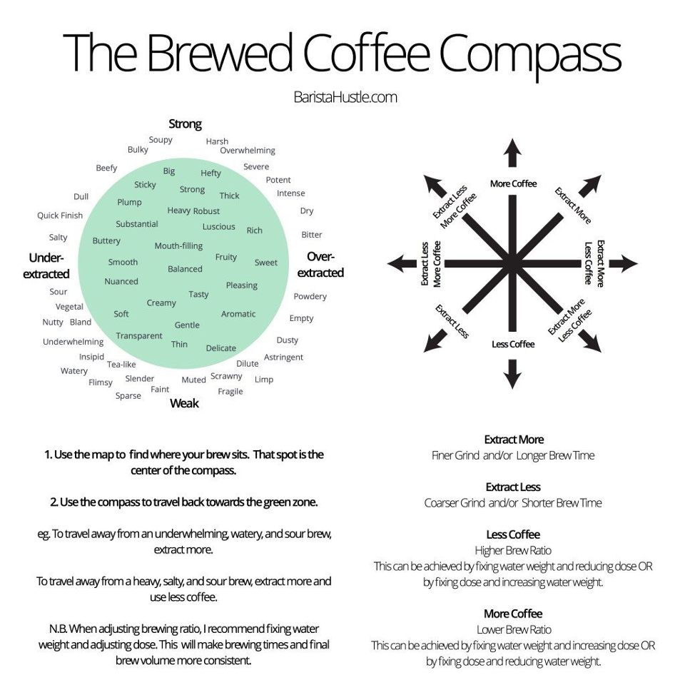

## lab location - offices and lab benches

[Desk assignments](https://docs.google.com/spreadsheets/d/1JmrgIWqgCegkAnWhVDr7hXzMWxeonOmWmzfqFT9p5WM/edit?usp=sharing)

[Shuttle information](https://case.edu/access-services/transportation/shuttles)
## lab onboarding - badge access, etc
If you are a brand new member of the lab, please add yourself to the lab census
by filling out this [google form](https://forms.gle/FxfgNXQyLtege3x69)! A
working lab census can be found in the appendix, including contact info and
research interests of all current members.

If you haven’t been added to the group slack workspace, ping Jake and he will
add you. Slack is the primary medium by which the group communicates outside of
meetings. In the slack you will find channels for just about any research focus
within the group in addition to channels for socializing and posting pics of
food.

Important background papers for the work in the Theory Division can be found in
the appendix (work in progress).

## lab meeting - schedule and format
Lab meetings are currently scheduled for every Tuesday from 2:30 pm - 4:30 pm.
There are currently four rotating groups of presenters- A, B, C, and D. If you
are new to the theory division, talk to Jake to figure out which group you
should be added to.

Currently, lab meetings are done over zoom (see the lab calendar or slack for
the link) and slides are presented via google slides. You can find the weekly
slide deck, along with the presentation archive, in this [google drive](https://drive.google.com/drive/folders/1Td6w38lMTlTl_yOHnCTZgT6SO2TUn5Rj). The G1
MD/PhD student in the lab is currently responsible for scheduling lab meetings.
For the 2020-2021 academic year, that’s Davis Weaver.

The format of the presentation is flexible and largely up to individual style,
although there should be an emphasis on efficiency to ensure that everyone has
time to present and receive feedback. There are a few common elements that each
member should have in their presentations:

- “Elevator pitch” slide
  - Should be a graphical illustration of all of your current projects - grows
  as your research progresses.
- Background slide
  - A more formal introduction to your presentation that provides sufficient
  background for a newcomer to the lab. This should be specific to the
  project(s) you are presenting that day (i.e., each project will have its own
  background slide).
- Ending with a “next steps” slide with a concrete action plan can also be
helpful for feedback.

Each of these background slides should have an accompanying paragraph that gives
a basic background for the project (not included in your presentation), complete
with hyperlinks to useful stuff.  This will eventually go on the website/wiki
somewhere - this will allow folks to fill themselves in a bit more, and should
provide breadcrumbs for further reading either of your own stuff, or of other
background work in the form of out-links.

Name | Focus | Group
-----|-------|------
Steph | Math Evo | A
Jeff | Bacterial Evo, Math Evo | A
Ruipeng | Math Evo | A
Linh | Math Evo | A
Eshan | Math Evo | A
Em | Math Evo | A
Arda | Informatics | B
Jess | Informatics | B
Davis | Informatics | B
Nikhil | Informatics, Math Evo | B
Abhilash | Informatics | B
Dena | Informatics | B 
Tommy | Informatics | B
Raoul | TDA | C
Eashwar | TDA | C
Geoff | Game theory | C
Adam | TDA | C
Luka | | C
Vish | Engineering | D
Masahiro | wet lab | D
Mina | wet lab | D
Kyle | Bacterial Evo | D
Rupleen | | D
Kristi | | D

## case cluster computing

To get access to the Case High Performance Computing Cluster, email
hpc-support@case.edu and cc Jake.

Link to the cluster: https://ondemand.case.edu/pun/sys/dashboard
*Note: you must be on Case Wireless or using a VPN to access.

## lab file server

To access the lab file server, you will need to download a file transfer
protocol (FTP) such as FileZilla or Cyberduck. Then, you can message someone
(i.e. Eshan) in the lab to get the server name, username, and password. You can
then access the server from anywhere, without a VPN.

## espresso machine

Start here: [Video guide to brewing espresso in the Theory Division](https://drive.google.com/drive/folders/1MO-VkAS1xKHvoDxoM6z4nsUQJoBjzKZ1)

The lab espresso machine is a Profitec Pro 800 (user manual found [here](https://www.profitec-espresso.com/media/pages/produkte/pro800/3880687400-1559739290/pro_800.pdf)
or [here](https://www.profitec-espresso.com/en/products/pro800)). The grinder is
a Baratza Sette 270Wi (user manual found [here](https://baratza.com/grinder/sette-270wi/))

Written brewing guide is a work in progress.

Other details:
- Look here for a [good thread](https://www.home-barista.com/reviews/profitec-pro-800-review-t44660.html) on this machine.
- Ideally you should allow the machine 45 minutes to heat up. If you’re in a
hurry, you can reduce the warmup time by flushing water through the grouphead
once the steam boiler is fully pressurized and then waiting another 5 minutes
for the group temperature to restabilize (WARNING: hot steam will flow freely
from the grouphead).

## mental health

If you are a student at Case Western Reserve University, you are entitled to 12
free counseling sessions per year through [University Health and Counseling
Services](https://case.edu/studentlife/healthcounseling/)
(no appointment necessary!). If you are unsure if you need or would benefit from
counseling, it’s low risk to try it out and see if it’s for you. During the
COVID-19 pandemic, the 12 session limit has been lifted indefinitely.

The MSTP also maintains a [Mental Health and Wellness Resources](https://case.edu/medicine/sites/case.edu.medicine/files/2020-01/List%20of%20Available%20Mental%20Health%20Resources.pdf) document, which can also be found on the "For Current Students" tab on the [MSTP website](https://case.edu/medicine/admissions-programs/md-phd-program/).

## faqs

Q: Why are people slacking me at 12:30 a.m.?
A: We all work during the hours that work for us! Of course, there may be exceptions… But In general, don’t feel obligated to respond to emails or requests that are outside of your normal working hours.

## appendix

### classic theory division background papers

#### fitness landscape papers
1. Wright, Sewall. The roles of mutation, inbreeding, crossbreeding, and selection in evolution. Vol. 1. na, 1932.
1. Weinreich, Daniel M., et al. "Darwinian evolution can follow only very few mutational paths to fitter proteins." science 312.5770 (2006): 111-114.
1. Hinkley, Trevor, et al. "A systems analysis of mutational effects in HIV-1 protease and reverse transcriptase." Nature genetics 43.5 (2011): 487-489.
1. De Visser, J. Arjan Gm, and Joachim Krug. "Empirical fitness landscapes and the predictability of evolution." Nature Reviews Genetics 15.7 (2014): 480-490.
1. Nichol, Daniel, et al. "Steering evolution with sequential therapy to prevent the emergence of bacterial antibiotic resistance." PLoS Comput Biol 11.9 (2015): e1004493.
1. Kaznatcheev, Artem. "Computational complexity as an ultimate constraint on evolution." Genetics 212.1 (2019): 245-265.

#### collateral sensitivity papers
1. Imamovic, Lejla, and Morten OA Sommer. "Use of collateral sensitivity networks to design drug cycling protocols that avoid resistance development." Science translational medicine 5.204 (2013): 204ra132-204ra132.
1. Fuentes-Hernandez, Ayari, et al. "Using a sequential regimen to eliminate bacteria at sublethal antibiotic dosages." PLoS Biol 13.4 (2015): e1002104.
1. Dhawan, Andrew, et al. "Collateral sensitivity networks reveal evolutionary instability and novel treatment strategies in ALK mutated non-small cell lung cancer." Scientific reports 7.1 (2017): 1-9.
1. Yoshida, Mari, et al. "Time-programmable drug dosing allows the manipulation, suppression and reversal of antibiotic drug resistance in vitro." Nature communications 8.1 (2017): 1-11.
1. Nichol, Daniel, et al. "Antibiotic collateral sensitivity is contingent on the repeatability of evolution." Nature communications 10.1 (2019): 1-10.

#### automated experimental evolution (EVE) papers
1. Toprak, Erdal, et al. "Building a morbidostat: an automated continuous-culture device for studying bacterial drug resistance under dynamically sustained drug inhibition." Nature protocols 8.3 (2013): 555-567.
1. Wong, Brandon G., et al. "Precise, automated control of conditions for high-throughput growth of yeast and bacteria with eVOLVER." Nature biotechnology 36.7 (2018): 614-623.

#### evolution and spatial structure papers
1. Frean, Marcus, Paul B. Rainey, and Arne Traulsen. "The effect of population structure on the rate of evolution." Proceedings of the Royal Society B: Biological Sciences 280.1762 (2013): 20130211.

#### Math-onco papers
1. Anderson, Alexander RA, and Mark A. J. Chaplain. "Continuous and discrete mathematical models of tumor-induced angiogenesis." Bulletin of mathematical biology 60.5 (1998): 857-899.
1. Anderson, Alexander RA, et al. "Tumor morphology and phenotypic evolution driven by selective pressure from the microenvironment." Cell 127.5 (2006): 905-915.
1. Gatenby, Robert A., et al. "Adaptive therapy." Cancer research 69.11 (2009): 4894-4903.

### census

The theory division is a highly dynamic lab and frequently has members or collaborators who span professional boundaries. To keep track of who is currently an active member of the lab, we’re utilizing a google sheet which you can add yourself to via this [google form](https://forms.gle/FxfgNXQyLtege3x69)! You can view the current census by clicking the link below:

[Theory Division Census (Responses)](https://docs.google.com/spreadsheets/d/1qRgyQlYfRQC5odrmjI9fZc7Ezvs0GgFhb8uikxs1nIk/edit?usp=sharing)
